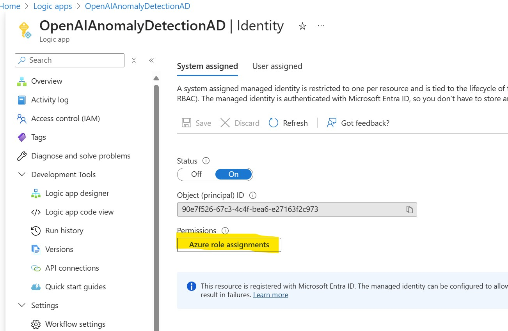
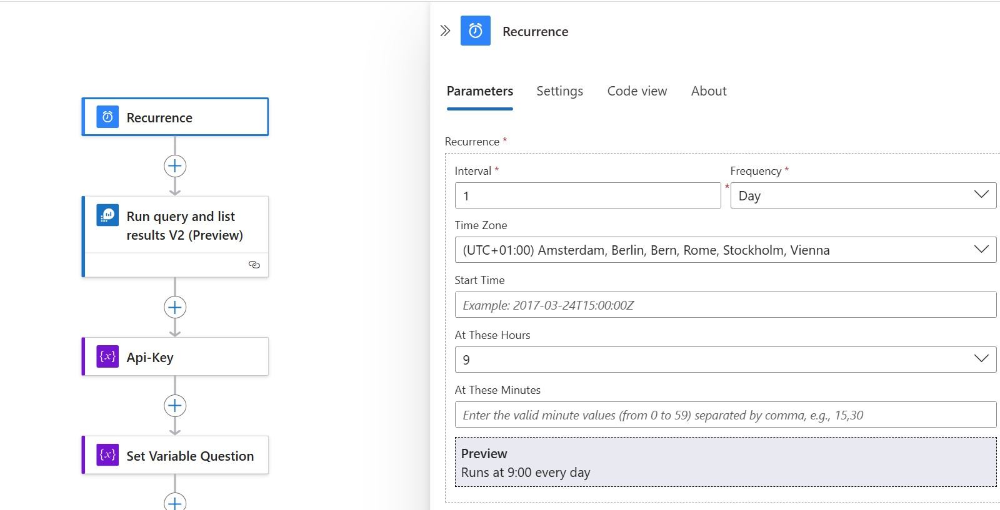
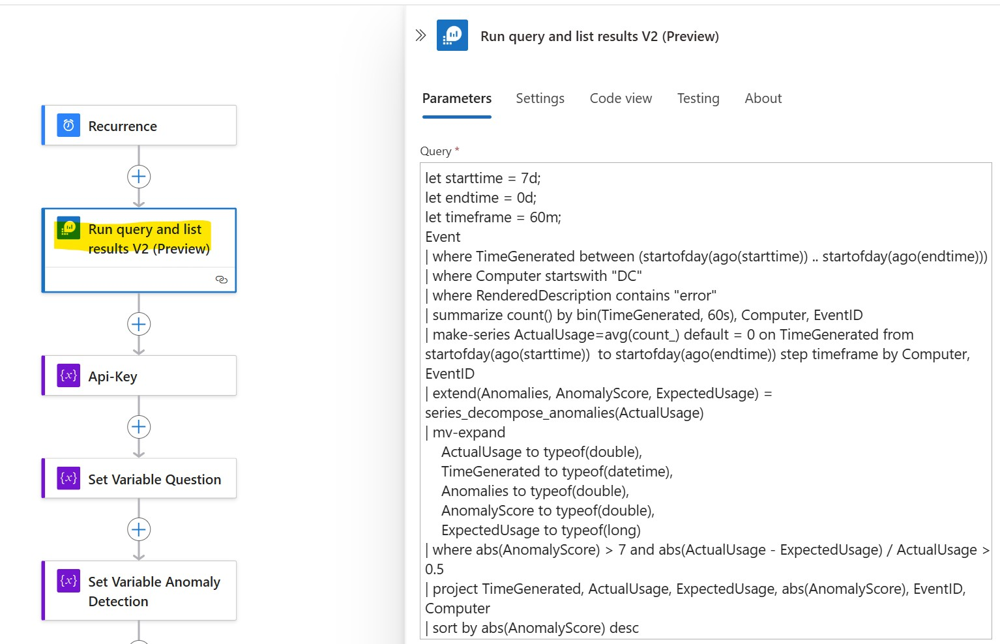
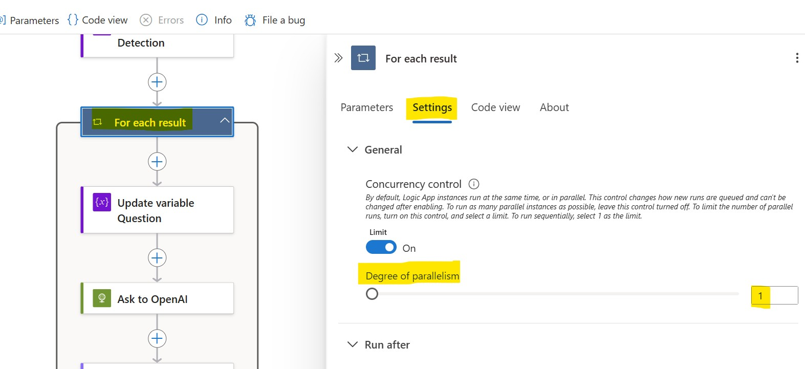
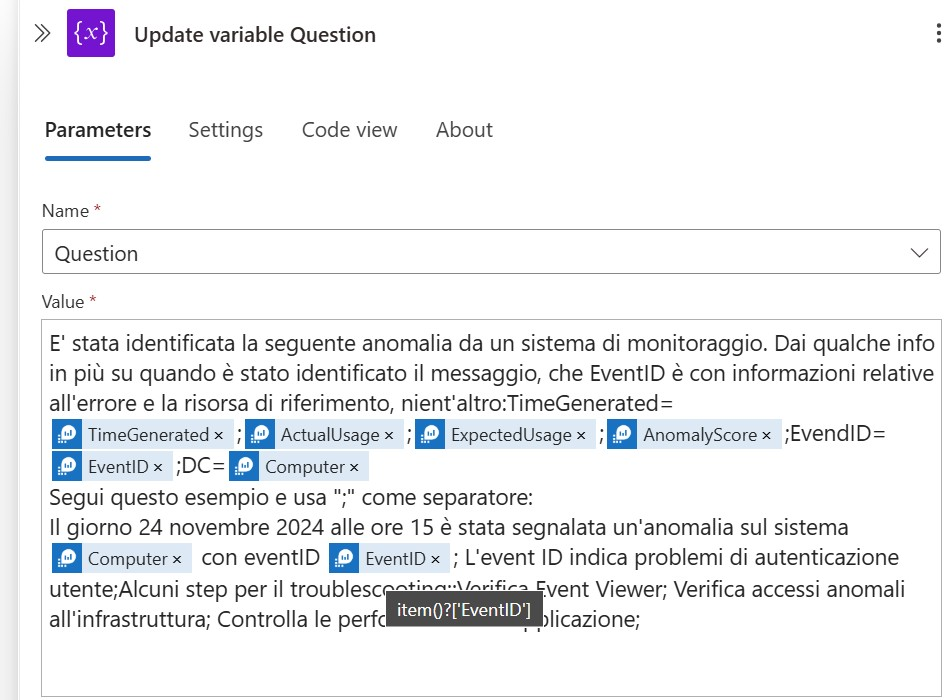
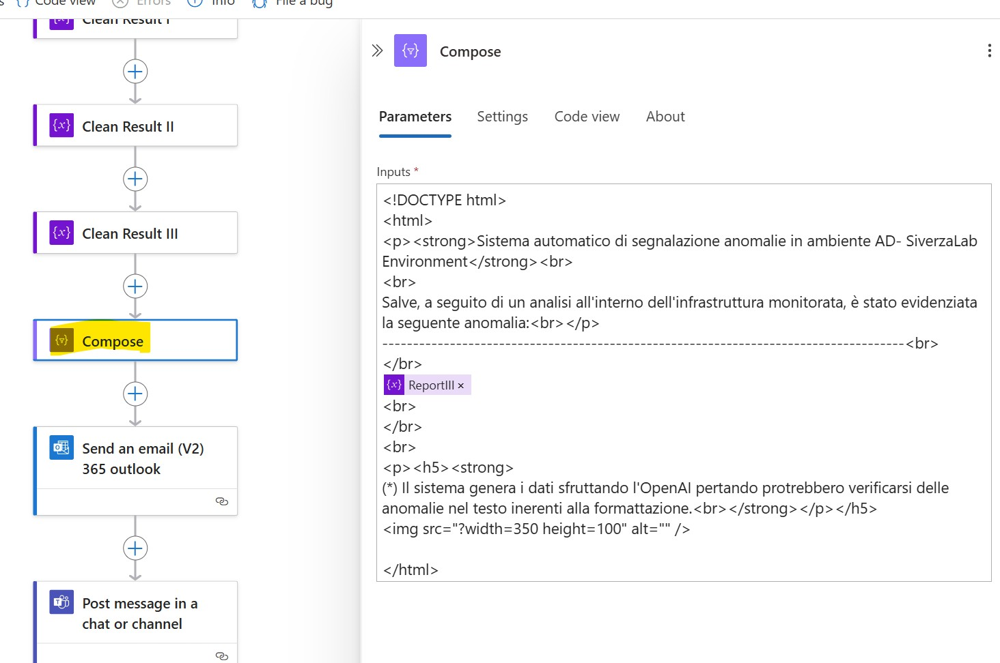
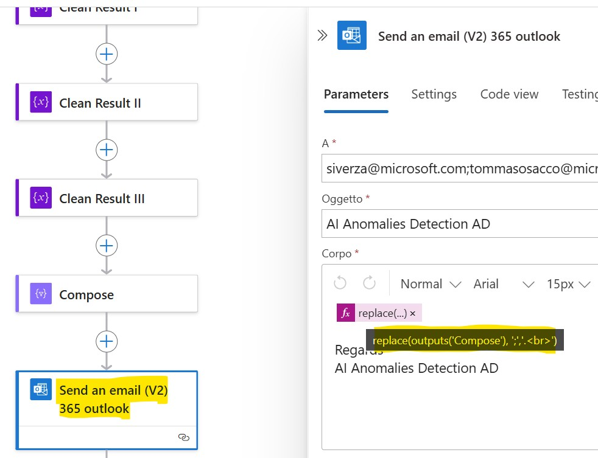

<h3>Azure UpdateManager OpenAI integration: Configuration</h3>
 
| **Parameters** | **Information** | **Note** |
| ------------- | ------------- | ------------- |
| recurrence | The scheduled option for manage the Logic App execution | Configure the recurrence following your requirements |
| api-key | The API code for manage your OpenAI service | Put your question in the "value" attribute |
| changeendpointname | Insert the OpenAI endpoint name | You can found the value inside the OpenAI resource inside Azure Cognitive Service |
| changemodelname | Insert the model name | You can found the value inside the OpenAI resource inside Azure Cognitive Service |

<h3> Important </h3>
 This LogApp and the following changes are an example of integrating AnomalyDetection results with OpenAI, creating a report to send via Email with OpenAI comment. 

 
<h3>Required Identity</h3>
<h4>Managed Identity</h4>

After the deployment the Logic App is ready to be configured. As a first requirement, check if the Managed Identity is active and assign the required permission to work with the required resources (Log Analytics).




Ad this point, in the Logic App Designer, configure the Recurrence following your requirements.





"Run query and list result V2" is the core block here. We have to replace the block using the same one and modify the query. Below you can found the block and the query:




```KQL
let starttime = 7d; 
let endtime = 0d;
let timeframe = 60m;
Event 
| where TimeGenerated between (startofday(ago(starttime)) .. startofday(ago(endtime))) 
| where Computer startswith "DC"
| where RenderedDescription contains "error" 
| summarize count() by bin(TimeGenerated, 60s), Computer, EventID 
| make-series ActualUsage=avg(count_) default = 0 on TimeGenerated from startofday(ago(starttime)) 	to startofday(ago(endtime)) step timeframe by Computer, EventID 
| extend(Anomalies, AnomalyScore, ExpectedUsage) = series_decompose_anomalies(ActualUsage) 
| mv-expand
    ActualUsage to typeof(double),
    TimeGenerated to typeof(datetime),
    Anomalies to typeof(double),
    AnomalyScore to typeof(double),
    ExpectedUsage to typeof(long)
| where abs(AnomalyScore) > 7 and abs(ActualUsage - ExpectedUsage) / ActualUsage > 0.5 
| project TimeGenerated, ActualUsage, ExpectedUsage, abs(AnomalyScore), EventID, Computer
| sort by abs(AnomalyScore) desc
```


The Api-Key is needed for interact with the OpenAI model. You can place your key in the "Api-Key" variable.


Leave the Set Variable Question and Set Variable Anomaly Detection empty, the focus now is the For_each_result. Click on it, swith to "Setting", activate the "Limit" and set the "Degree of parallelism" to 1:





"Update variable Question" is another important point, because it handle the question that we pass to OpenAI. Modify the variable following your requirements.





At this point is importat to customize the "Ask to OpenAI" block. This block handle the communication with the LLM model. Customize the required parameters.


One of the last block to customize is the "Compose", because it manage the format of the communication that the e-mail block send to the attenders. Here you can found an example:

```Compose
<!DOCTYPE html>
<html>
<p><strong>Sistema automatico di segnalazione anomalie in ambiente AD- SiverzaLab Environment</strong><br>
<br>
Salve, a seguito di un analisi all'interno dell'infrastruttura monitorata, è stato evidenziata la seguente anomalia:<br></p>
-------------------------------------------------------------------------------------<br>
</br>
@{variables('ReportIII')}
<br>
</br>
<br>
<p><h5><strong>
(*) Il sistema genera i dati sfruttando l'OpenAI pertando protrebbero verificarsi delle anomalie nel testo inerenti alla formattazione.<br></strong></p></h5>


</html>
```
> [!TIP]
> The provided Logic App, as an artifact, will send an email without a condition. An improvement could be to manage the result using a condition, and if the condition is not satisfied, send an e-mail, in order to avoid unattended results. The configuration is up to your requirements.




The last point, we are talking about the "Send an email (V2) block. This block is used for send communication to the attenders. Customize the email, you can use the example below:


