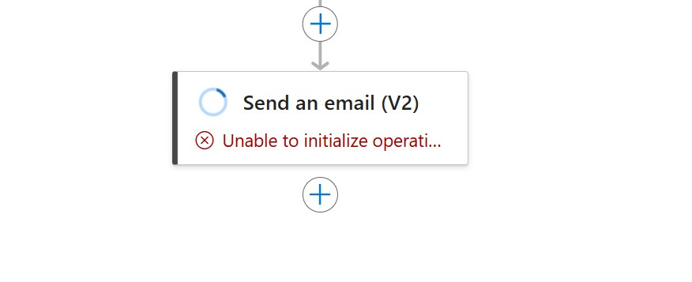

<h3>Azure SQL BPA OpenAI integration: Configuration</h3>
 
| **Parameters** | **Information** | **Note** |
| ------------- | ------------- | ------------- |
| replacewithsubid | Connection setting during deployment | Replace with your Subscription ID |
| replacewithRG | Connection setting during deployment | Replace with the selected RG Name for the deployment |
| replace with tenant id | HTTP Module: Tenant ID | Replace with your Tenant ID |

 
 
<h3> Deployment and Result </h3>
 
After deployment completed, please follow the documentation:

Change the broken module __Run query and list result__ with a new one
 
Before: <br>


After: <br>


Compile all the information following your configuration.<br>
For the query field past the code below:

```query
let selectedCategories = dynamic([]);
let selectedTotSev = dynamic([]);
SqlAssessment_CL
| extend asmt = parse_csv(RawData)
| where asmt[11] =~ "MSSQLSERVER" 
| extend
    AsmtId=tostring(asmt[1]),
    CheckId=tostring(asmt[2]),
    DisplayString=asmt[3],
    Description=tostring(asmt[4]),
    HelpLink=asmt[5],
    TargetType=case(asmt[6] == 1, "Server", asmt[6] == 2, "Database", ""),
    TargetName=tostring(asmt[7]), 
    Severity=case(asmt[8] == 30, "High", asmt[8] == 20, "Medium", asmt[8] == 10, "Low", asmt[8] == 0, "Information", asmt[8] == 1, "Warning", asmt[8] == 2, "Critical", "Passed"),
    Message=tostring(asmt[9]),
    TagsArr=split(tostring(asmt[10]), ","),
    Sev = toint(asmt[8])
| where isnotempty(AsmtId)  
    and (set_has_element(dynamic(['*']), CheckId) or "'*'" == "'*'")
    and (set_has_element(dynamic(['*']), TargetName) or "'*'" == "'*'")
    and set_has_element(dynamic([30, 20, 10, 0]), Sev)
    and (array_length(set_intersect(TagsArr, dynamic(['*']))) > 0 or "'*'" == "'*'")
    and (CheckId == '''' and Sev == 0 or "''" == "''")
| extend Category = case(
                        array_length(set_intersect(TagsArr, dynamic(["CPU", "IO", "Storage"]))) > 0,
                        '0',
                        array_length(set_intersect(TagsArr, dynamic(["TraceFlag", "Backup", "DBCC", "DBConfiguration", "SystemHealth", "Traces", "DBFileConfiguration", "Configuration", "Replication", "Agent", "Security", "DataIntegrity", "MaxDOP", "PageFile", "Memory", "Performance", "Statistics"]))) > 0,
                        '1',
                        array_length(set_intersect(TagsArr, dynamic(["UpdateIssues", "Index", "Naming", "Deprecated", "masterDB", "QueryOptimizer", "QueryStore", "Indexes"]))) > 0,
                        '2',
                        '3'
                    )
| where (Sev >= 0 and array_length(selectedTotSev) == 0 or Sev in (selectedTotSev))
    and (Category in (selectedCategories) or array_length(selectedCategories) == 0)
| project
    TargetType,
    TargetName,
    Severity,
    Message,
    Tags=strcat_array(array_slice(TagsArr, 1, -1), ', '),
    CheckId,
    Description,
    HelpLink = tostring(HelpLink),
    SeverityCode = toint(Sev)
| order by SeverityCode desc, TargetType desc, TargetName asc
| project-away SeverityCode 
```

Configure the Api Key with the value inside your OpenAI Service:


Configure ForeachSQLResult section with value of query result and each parameter in Question variable:


Configure the severity level as a condition filter as you prefer:


Now configure the HTTP Connector for OpenAI Connection following this configuration:


The last configuration is change the broken module __Send an email (V2)__ with a new one :

Before


After
