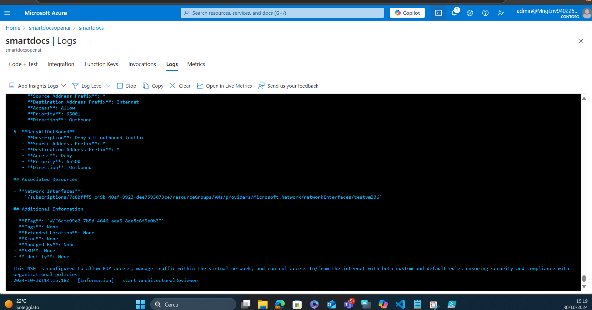

<h2>SmartDocs Azure Function<h2>

<h3>Overview</h3>
The SmartDocs Azure Function is designed to generate technical documentation and detailed reporting based on Azure resource metadata using Azure OpenAI. The function leverages managed authentication to access Azure services and consolidates resource metadata into an easily readable, automatically generated document.


> [!NOTE]
> SmartDocs is an artifact designed to be tailored to specific client needs. Depending on requirements, aspects such as the document storage path and authentication/configuration details may need to be customized.


<h3>Requirements</h3>

- Azure OpenAI-CoreIntegration Landing Zone deployed
    - A Default Consumption Function App will be deployed with the [foundation ARM Template](../OpenAI-CoreIntegrationLZ/README.md)
    - OpenAI in place, always deployed with the [foundation ARM Template](../OpenAI-CoreIntegrationLZ/README.md)
- A local environment ready for deploy the Function App to azure. [Follow the instruction here](https://learn.microsoft.com/en-us/azure/azure-functions/create-first-function-vs-code-python).


> [!IMPORTANT]
> In the [Consumption Plan](https://learn.microsoft.com/en-us/azure/azure-functions/consumption-plan), the function has a maximum runtime of 10 minutes. For larger workloads, use an App Service Plan with a higher SKU, such as Premium or Dedicated, to increase the allowable execution time.
 
 
- Managed Identity configured with read access to the required resources (subscriptions, OpenAI for generating text and so on).

- QUESTION_ENDPOINT Environment Variable: The Azure OpenAI endpoint for sending requests.

<h3>Example files for Function deployment</h3>

- [host.json](host.json)
- [local.settings.json](./local.settings.json)
- [requirements.txt](./requirements.txt)
- [function_app.py](./function_app.py)

<h3>PowerShell Script for Invocation</h3>
Here is a PowerShell script to invoke the function using an HTTP POST request:


```
powershell
Copia codice
# Function app URL
$functionUrl = "https://smartdocsopenai.azurewebsites.net/api/smartdocs"

# Parameters to send
$body = @{
    tag_key = "Workload"
    tag_value = "Production"
}

# Invoke the Function App
$response = Invoke-RestMethod -Uri $functionUrl -Method Post -Body ($body | ConvertTo-Json) -ContentType "application/json"

# Output the response
$response
```




> [!NOTE]
> When planning to use this function for high workloads configure a Premium App Service Plan or higher to avoid time limitations.
Monitor execution logs for potential issues related to timeouts or resource limits.
Future Customizations


<h3>Support and Contributions</h3>
Contributions and enhancement requests are welcome! For any additional customization, feel free to open an issue or submit a pull request in this repository.

