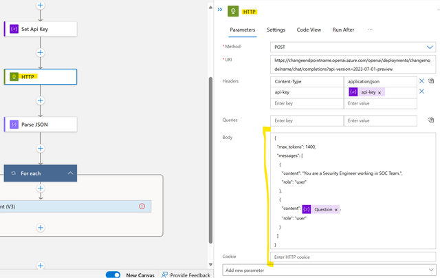

<h3>Azure Sentinel OpenAI integration: Configuration</h3>
 
| **Parameters** | **Information** | **Note** |
| ------------- | ------------- | ------------- |
| replacewithsubid | Connection setting during deployment | Replace with your Subscription ID |
| repreplacewithRG | Connection setting during deployment | Replace with the selected RG Name for the deployment |
| Question  | Insert the Question for OpenAI  | The parameter is inside the first "Initialize Variable". Put your question in the "value" attribute |
| api-key | The API code for manage your OpenAI service | The parameter is inside the second "Initialize Variable". Put your question in the "value" attribute  |
| changeendpointname | Insert the OpenAI endpoint name | You can found the value inside the OpenAI resource inside Azure Cognitive Service |
| changemodelname | Insert the model name | You can found the value inside the OpenAI resource inside Azure Cognitive Service |

<h3>Required Connector</h3>

Durint the deployment please change the required value inside the connection string with the subscription id and the resource group name. After that, when the deployment is completed, please follow the documentation:

Configure the Question as you like. You can found a standard configuration by default:

Configure the Api Key with the value inside your OpenAI Service:

Now configure the HTTP Connector for OpenAI Connection following this configuration:

The last configuration is about the "Add Content to Incident (V3)". Follow the exaple below:

