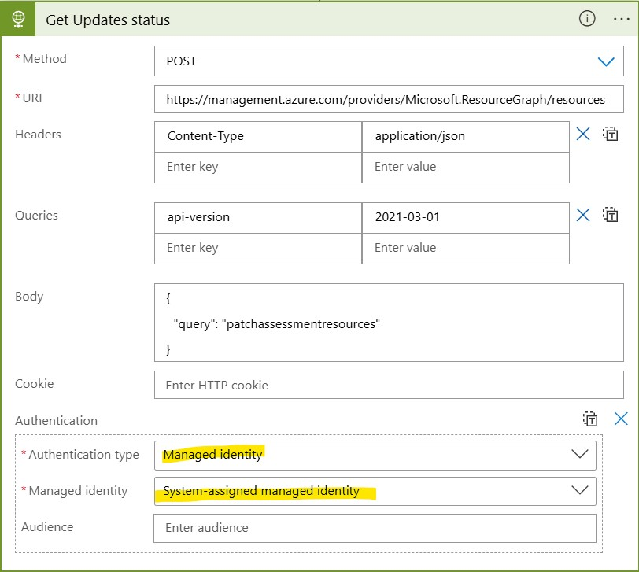
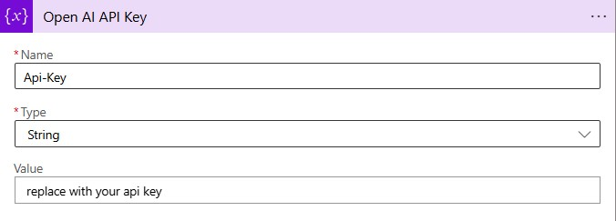

<h3>Azure UpdateManager OpenAI integration: Configuration</h3>
 
| **Parameters** | **Information** | **Note** |
| ------------- | ------------- | ------------- |
| **Parameters** | **Information** | **Note** |
| ------------- | ------------- | ------------- |
| replacewithsubid | Connection setting during deployment | Replace with your Subscription ID |
| repreplacewithRG | Connection setting during deployment | Replace with the selected RG Name for the deployment |
| api-key | The API code for manage your OpenAI service | The parameter is inside the second "Initialize Variable". Put your question in the "value" attribute  |
| changeendpointname | Insert the OpenAI endpoint name | You can found the value inside the OpenAI resource inside Azure Cognitive Service |
| changemodelname | Insert the model name | You can found the value inside the OpenAI resource inside Azure Cognitive Service |

<h3> Important </h3>
 This LogApp and the following changes are an example of integrating UpdateManager results with OpenAI, creating a report send via Email with OpenAI comment of pending Security Update of your environment. 
 
 
<h3>Deploy</h3>

When you deploy, replace with your SubscriptionID and ResourceGroup Name:

<h3>Required Identity</h3>
<h4>Managed Identity</h4>

When the deployment is completed go in your Logic App and create a Managed Identity following the example below and give them  permission:

<h3> Deployment and Result </h3>
 
After deployment completed, please follow the documentation:

As first step please configure the required recurrence:

Configure the Api Key with the value inside your OpenAI Service:

Configure __ForeachSQLResult__ section with value of query result and each parameter in Question variable:

Now configure the HTTP Connector for OpenAI Connection following this configuration:

The last configuration is change the broken module __Send an email (V2)__ with a new one, add the attachment and customize the file name :

Before  

After  

Now save your LogicApp and __Enable__